# Emoji

[](http://www.apache.org/licenses/LICENSE-2.0.html)

A simple library to add Emoji support to your Android app. In a PopupWindow Emojis can be choose skin. In order to edit and display text with Emojis this library provides public APIs: [`EmojiButton`](emoji/src/main/java/dev/leonardpark/emoji/emojicompat/EmojiButton.kt), [`EmojiCheckbox`](emoji/src/main/java/dev/leonardpark/emoji/emojicompat/EmojiCheckbox.kt), [`EmojiEditText`](emoji/src/main/java/dev/leonardpark/emoji/emojicompat/EmojiEditText.kt), [`EmojiRadioButton`](emoji/src/main/java/dev/leonardpark/emoji/emojicompat/EmojiRadioButton.kt), [`EmojiTextView`](emoji/src/main/java/dev/leonardpark/emoji/emojicompat/EmojiTextView.kt) & [`EmojiToggleButton`](emoji/src/main/java/dev/leonardpark/emoji/emojicompat/EmojiToggleButton.kt)

This all emoji is Unicode 14.0 and following [Full Emoji List](http://unicode.org/emoji/charts/full-emoji-list.html) and [Full Emoji Modifier Sequences](https://unicode.org/emoji/charts/full-emoji-modifiers.html).

If have any emoji newst or missed or problems, please feel free to create [issue](../../issues) to tell me more information

The library has 8 different providers to choose from ([iOS](#ios-emojis), [EmojiOne](#emojione), [Google](#google-emojis), [Google Compat](#google-compat-emojis), [facebook](#facebook-emojis), [Twitter](#twitter-emojis), [Samsung](#samsung-emojis) & [Windows](#windows-emojis)).

## iOS Emojis

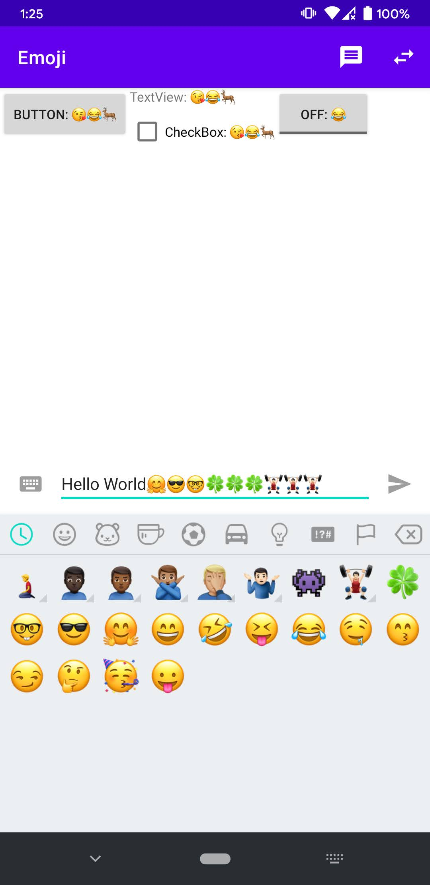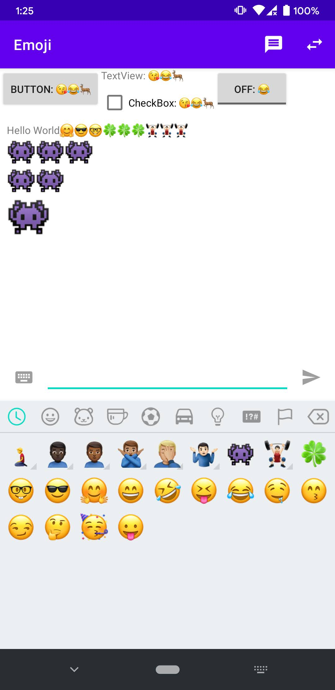

For getting the above iOS Emojis simply add the dependency and code below.

```groovy
implementation project(':emoji-ios')
```

And install the provider (preferably in your Application class):

```java
EmojiManager.install(new IosEmojiProvider()); // This line needs to be executed before any usage of EmojiCheckbox, EmojiEditTExt EmojiRadioButton, EmojiTextView or EmojiToggleButton.
```

```kotlin
EmojiManager.install(IosEmojiProvider()) // This line needs to be executed before any usage of EmojiCheckbox, EmojiEditTExt EmojiRadioButton, EmojiTextView or EmojiToggleButton.
```

## EmojiOne

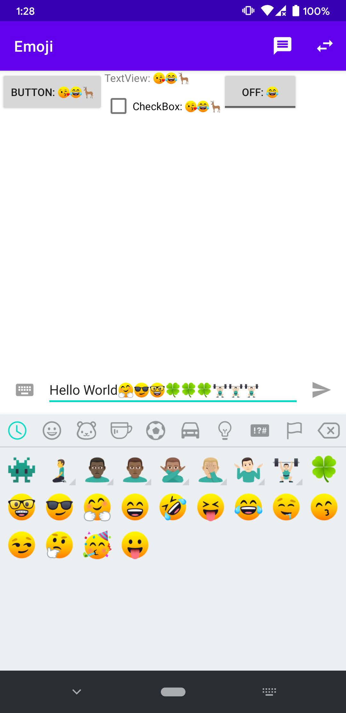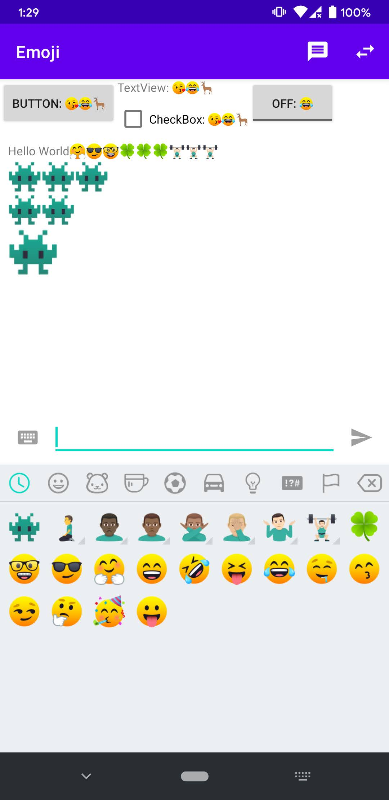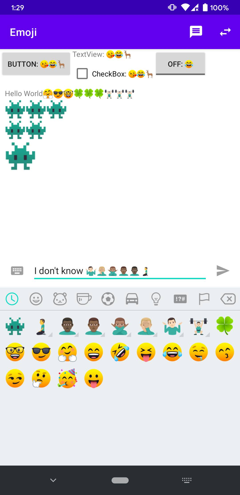

For getting the above EmojiOne Emojis simply add the dependency and code below.

```groovy
implementation project(':emoji-one')
```

And install the provider (preferably in your Application class):

```java
EmojiManager.install(new EmojiOneProvider()); // This line needs to be executed before any usage of EmojiCheckbox, EmojiEditTExt EmojiRadioButton, EmojiTextView or EmojiToggleButton.
```

```kotlin
EmojiManager.install(EmojiOneProvider()) // This line needs to be executed before any usage of EmojiCheckbox, EmojiEditTExt EmojiRadioButton, EmojiTextView or EmojiToggleButton.
```

## Google Emojis

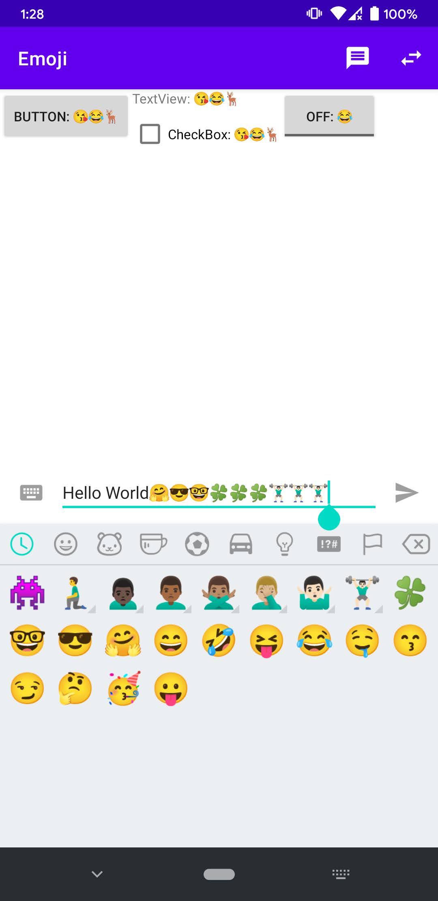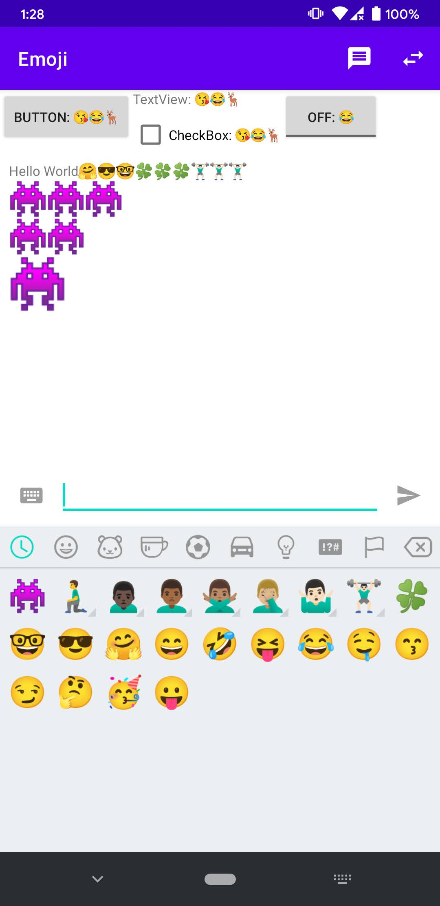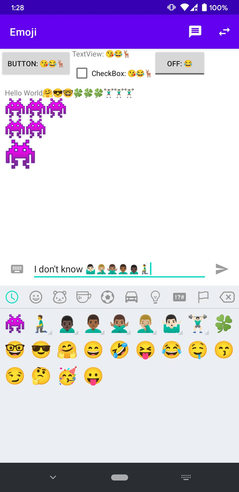

For getting the above Google Emojis simply add the dependency and code below.

```groovy
implementation project(':emoji-google')
```

And install the provider (preferably in your Application class):

```java
EmojiManager.install(new GoogleEmojiProvider()); // This line needs to be executed before any usage of EmojiCheckbox, EmojiEditTExt EmojiRadioButton, EmojiTextView or EmojiToggleButton.
```

```kotlin
EmojiManager.install(GoogleEmojiProvider()) // This line needs to be executed before any usage of EmojiCheckbox, EmojiEditTExt EmojiRadioButton, EmojiTextView or EmojiToggleButton.
```

## Google Compat Emojis

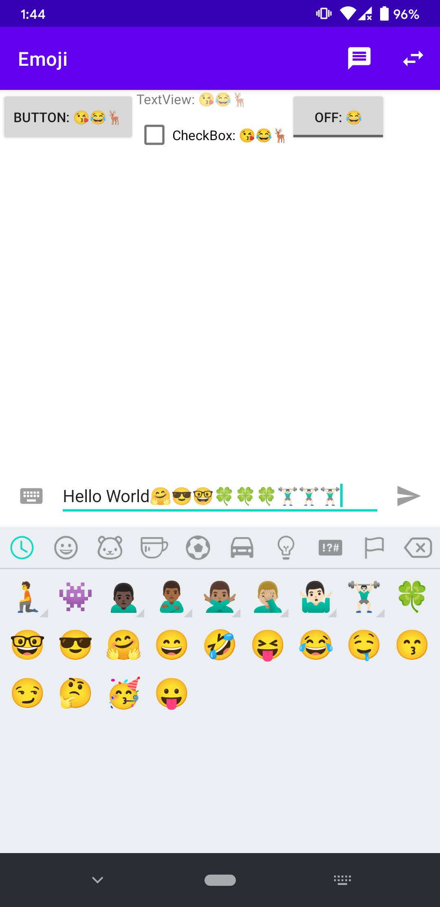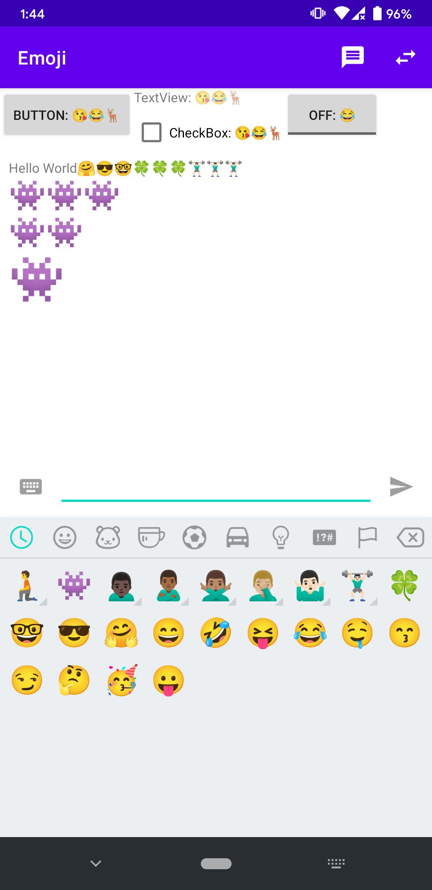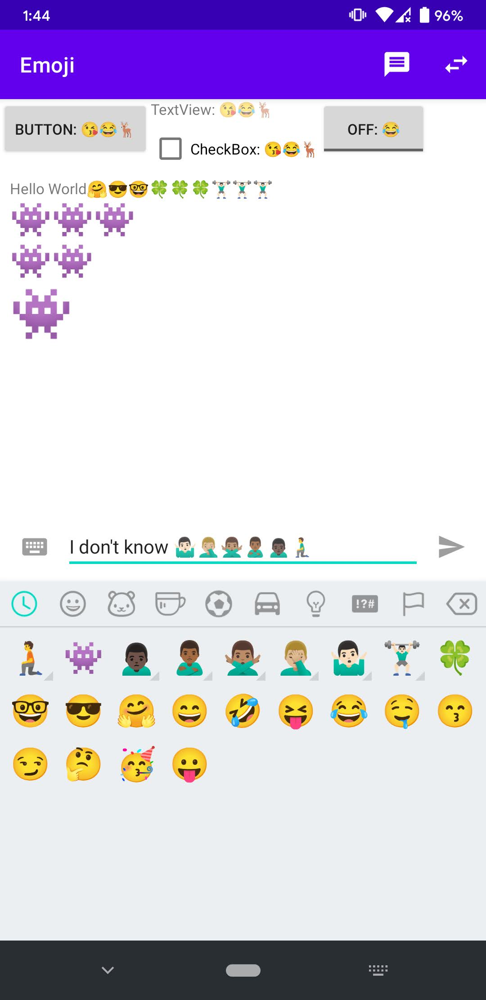

For getting the above Google Emojis simply add the dependency and code below.

```groovy
implementation project(':emoji-google-compat')
```

And install the provider (preferably in your Application class):

```java
EmojiManager.install(new GoogleCompatEmojiProvider(androidx emoji2 comapt)); // This line needs to be executed before any usage of EmojiCheckbox, EmojiEditTExt EmojiRadioButton, EmojiTextView or EmojiToggleButton.
```

```kotlin
EmojiManager.install(GoogleCompatEmojiProvider(androidx emoji2 comapt)) // This line needs to be executed before any usage of EmojiCheckbox, EmojiEditTExt EmojiRadioButton, EmojiTextView or EmojiToggleButton.
```

## Twitter emojis

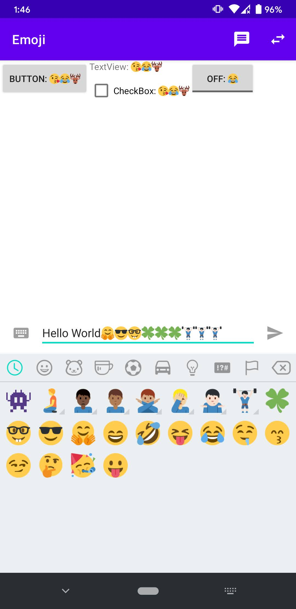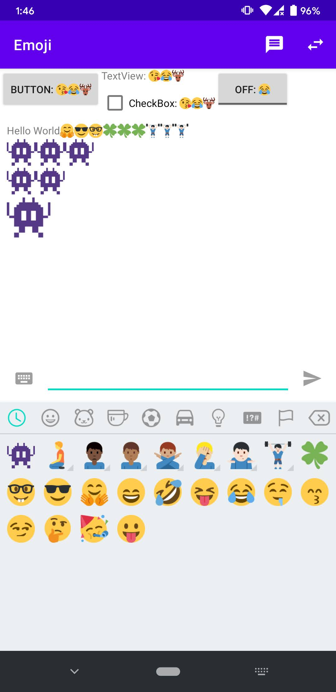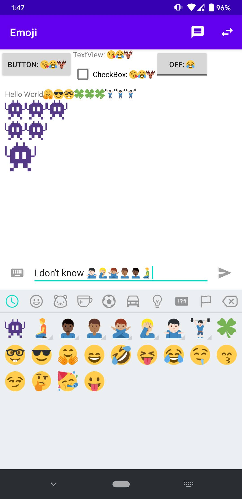

For getting the above Twitter Emojis simply add the dependency and code below.

```groovy
implementation project(':emoji-twitter')
```

And install the provider (preferably in your Application class):

```java
EmojiManager.install(new TwitterEmojiProvider()); // This line needs to be executed before any usage of EmojiCheckbox, EmojiEditTExt EmojiRadioButton, EmojiTextView or EmojiToggleButton.
```

```kotlin
EmojiManager.install(TwitterEmojiProvider()) // This line needs to be executed before any usage of EmojiCheckbox, EmojiEditTExt EmojiRadioButton, EmojiTextView or EmojiToggleButton.
```

## facebook Emojis

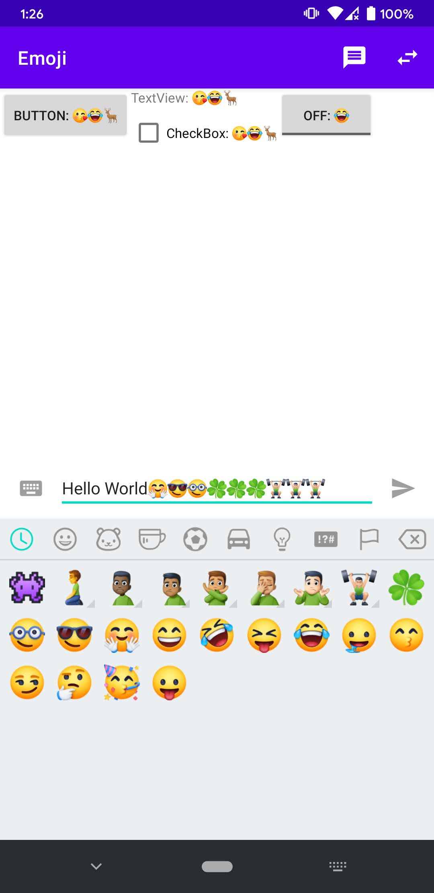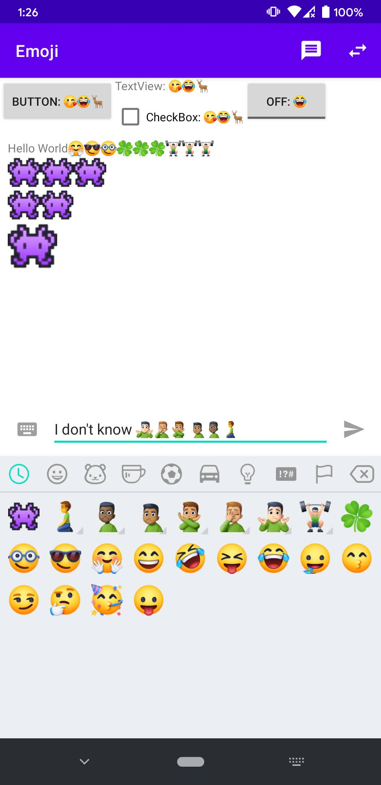

For getting the above iOS Emojis simply add the dependency and code below.

```groovy
implementation project(':emoji-facebook')
```

And install the provider (preferably in your Application class):

```java
EmojiManager.install(new FacebookEmojiProvider()); // This line needs to be executed before any usage of EmojiCheckbox, EmojiEditTExt EmojiRadioButton, EmojiTextView or EmojiToggleButton.
```

```kotlin
EmojiManager.install(FacebookEmojiProvider()) // This line needs to be executed before any usage of EmojiCheckbox, EmojiEditTExt EmojiRadioButton, EmojiTextView or EmojiToggleButton.
```

## samsung Emojis

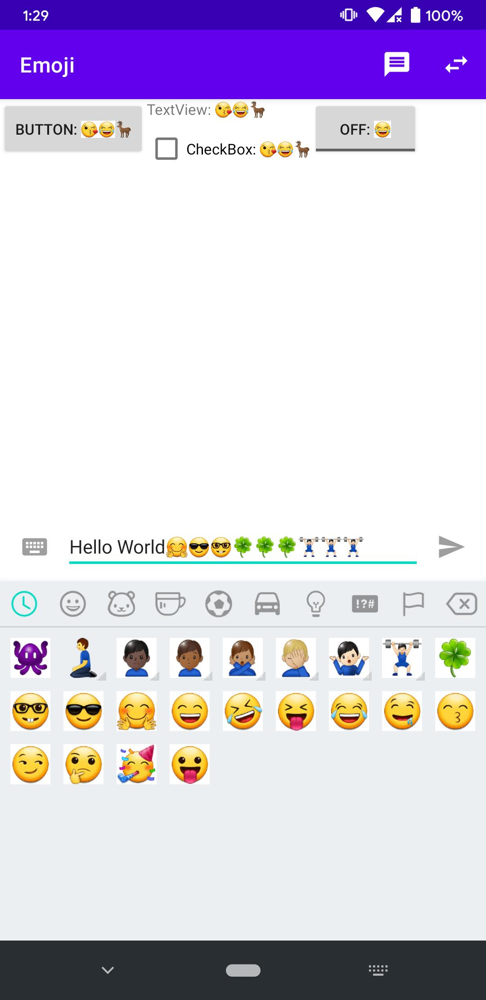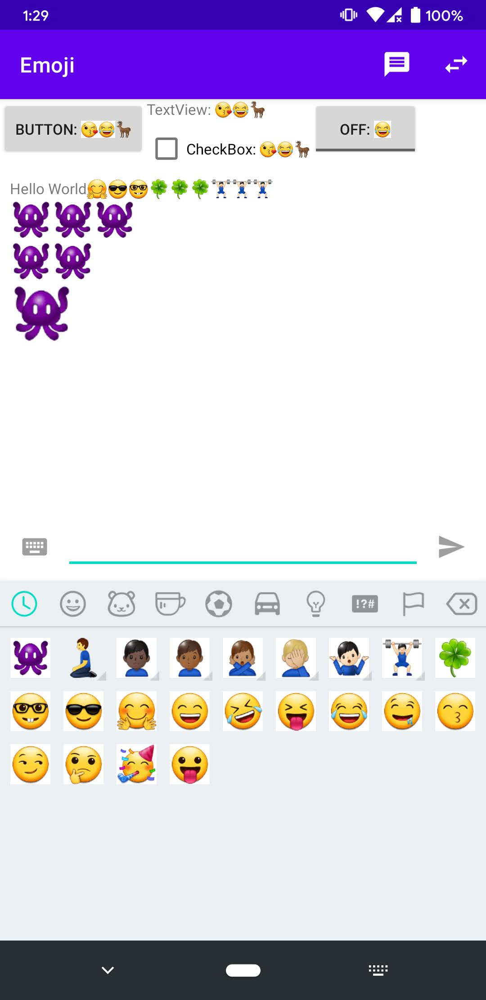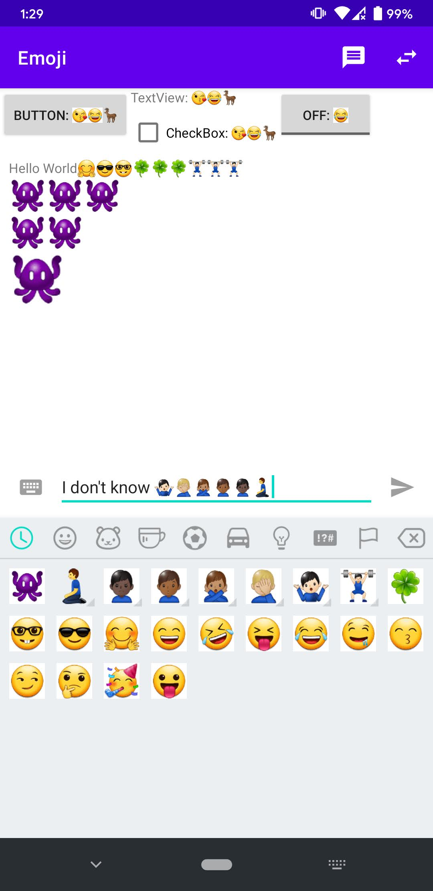

For getting the above iOS Emojis simply add the dependency and code below.

```groovy
implementation project(':emoji-samsung')
```

And install the provider (preferably in your Application class):

```java
EmojiManager.install(new SamsungEmojiProvider()); // This line needs to be executed before any usage of EmojiCheckbox, EmojiEditTExt EmojiRadioButton, EmojiTextView or EmojiToggleButton.
```

```kotlin
EmojiManager.install(SamsungEmojiProvider()) // This line needs to be executed before any usage of EmojiCheckbox, EmojiEditTExt EmojiRadioButton, EmojiTextView or EmojiToggleButton.
```

## windows Emojis

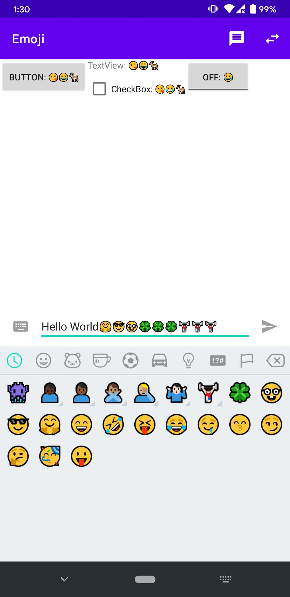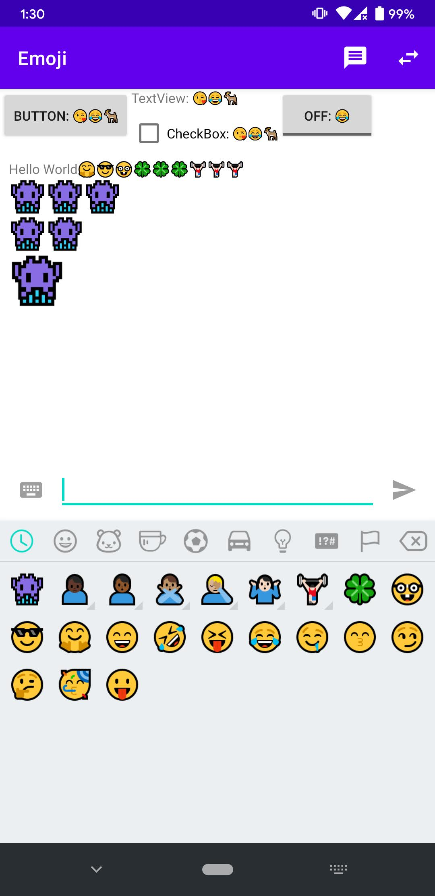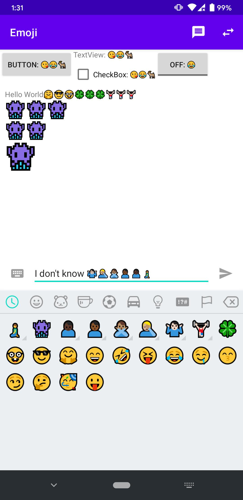

For getting the above iOS Emojis simply add the dependency and code below.

```groovy
implementation project(':emoji-windows')
```

And install the provider (preferably in your Application class):

```java
EmojiManager.install(new WindowsEmojiProvider()); // This line needs to be executed before any usage of EmojiCheckbox, EmojiEditTExt EmojiRadioButton, EmojiTextView or EmojiToggleButton.
```

```kotlin
EmojiManager.install(WindowsEmojiProvider()) // This line needs to be executed before any usage of EmojiCheckbox, EmojiEditTExt EmojiRadioButton, EmojiTextView or EmojiToggleButton.
```

### Custom Emojis

If you want to display your own Emojis you can create your own implementation of [`EmojiProvider`](emoji/src/main/java/dev/leonardpark/emoji/EmojiProvider.kt) and pass it to `EmojiManager.install`.

All of the core API lays in, which is being pulled in automatically by the provided implementations ([iOS](#ios-emojis), [EmojiOne](#emojione), [Google](#google-emojis), [Google Compat](#google-compat-emojis), [facebook](#facebook-emojis), [Twitter](#twitter-emojis), [Samsung](#samsung-emojis) & [Windows](#windows-emojis)):

```groovy
implementation project(':emoji')
```

### Inserting Emojis

Declare your [`EmojiEditText`](emoji/src/main/java/dev/leonardpark/emoji/emojicompat/EmojiEditText.kt) in your layout xml file.

```xml
<dev.leonardpark.emoji.EmojiEditText
  android:id="@+id/emojiEditText"
  android:layout_width="match_parent"
  android:layout_height="wrap_content"
  android:imeOptions="actionSend"
  android:inputType="textCapSentences|textMultiLine"
  android:maxLines="3"/>
```

To open the [`EmojiPopup`](emoji/src/main/java/dev/leonardpark/emoji/EmojiPopup.kt) execute the code below:

```java
final EmojiPopup emojiPopup = EmojiPopup.Builder.fromRootView(rootView).build(emojiEditText);
emojiPopup.toggle(); // Toggles visibility of the Popup.
emojiPopup.dismiss(); // Dismisses the Popup.
emojiPopup.isShowing(); // Returns true when Popup is showing.
```

The `rootView` is the rootView of your layout xml file which will be used for calculating the height of the keyboard.
`emojiEditText` is the [`EmojiEditText`](emoji/src/main/java/dev/leonardpark/emoji/emojicompat/EmojiEditText.kt) that you declared in your layout xml file.

### Displaying Emojis

```xml
<dev.leonardpark.emoji.emojicompat.EmojiButton
  android:id="@+id/emojiButton"
  android:layout_width="wrap_content"
  android:layout_height="wrap_content" />

<dev.leonardpark.emoji.EmojiCheckbox
  android:id="@+id/emojiCheckbox"
  android:layout_width="wrap_content"
  android:layout_height="wrap_content"/>

<dev.leonardpark.emoji.EmojiRadioButton
  android:id="@+id/emojiRadioButton"
  android:layout_width="wrap_content"
  android:layout_height="wrap_content"/>
```

Use the [`EmojiButton`](emoji/src/main/java/dev/leonardpark/emoji/emojicompat/EmojiButton.kt), [`EmojiCheckbox`](emoji/src/main/java/dev/leonardpark/emoji/emojicompat/EmojiCheckbox.kt), [`EmojiRadioButton`](emoji/src/main/java/dev/leonardpark/emoji/emojicompat/EmojiRadioButton.kt) and call `setText` with the String that contains Unicode encoded Emojis.

```xml
<dev.leonardpark.emoji.EmojiTextView
  android:id="@+id/emojiTextView"
  android:layout_width="wrap_content"
  android:layout_height="wrap_content"/>
```

Use the [`EmojiTextView`](emoji/src/main/java/dev/leonardpark/emoji/emojicompat/EmojiTextView.kt) and call `setText` with the String that contains Unicode encoded Emojis. To change the size of the displayed Emojis use the `lineHeight` property from TextView.

```xml
<dev.leonardpark.emoji.emojicompat.EmojiToggleButton
  android:id="@+id/emojiToggleButton"
  android:layout_width="wrap_content"
  android:layout_height="wrap_content"/>
```

Use the [`EmojiToggleButton`](emoji/src/main/java/dev/leonardpark/emoji/emojicompat/EmojiToggleButton.kt) and call `setTextOn` and `setTextOff` with the String that contains Unicode encoded Emojis.

## Listeners

The [`EmojiPopup`](emoji/src/main/java/dev/leonardpark/emoji/EmojiPopup.kt) builder allows you to declare several listeners.

```java
setOnSoftKeyboardCloseListener(OnSoftKeyboardCloseListener listener);
setOnEmojiClickListener(OnEmojiClickListener listener);
setOnSoftKeyboardOpenListener(OnSoftKeyboardOpenListener listener);
setOnEmojiPopupShownListener(OnEmojiPopupShownListener listener);
setOnEmojiPopupDismissListener(OnEmojiPopupDismissListener listener);
setOnEmojiBackspaceClickListener(OnEmojiBackspaceClickListener listener);
```

### Custom Recent Emoji implementation

You can pass your own implementation of the recent Emojis. Just let one of your classes implement the [`RecentEmoji`](emoji/src/main/java/dev/leonardpark/emoji/RecentEmoji.kt) interface and pass it when you're building the [`EmojiPopup`](emoji/src/main/java/dev/leonardpark/emoji/EmojiPopup.kt):

```java
setRecentEmoji(yourClassThatImplementsRecentEmoji)
```

If no instance or a null instance is set the [default implementation](./emoji/src/main/java/dev/leonardpark/emoji/RecentEmojiManager.kt) will be used.

### Custom Variant Emoji implementation

You can pass your own implementation of the variant Emojis. Just let one of your classes implement the [`VariantEmoji`](emoji/src/main/java/dev/leonardpark/emoji/VariantEmoji.kt) interface and pass it when you're building the [`EmojiPopup`](emoji/src/main/java/dev/leonardpark/emoji/EmojiPopup.kt):

```java
setVariantEmoji(yourClassThatImplementsVariantEmoji)
```

If no instance or a null instance is set the [default implementation](./emoji/src/main/java/dev/leonardpark/emoji/VariantEmojiManager.kt) will be used.

# Proguard

No configuration needed.

# License

Copyright (C) 2022 Leo - Leo Wu

Licensed under the Apache License, Version 2.0
